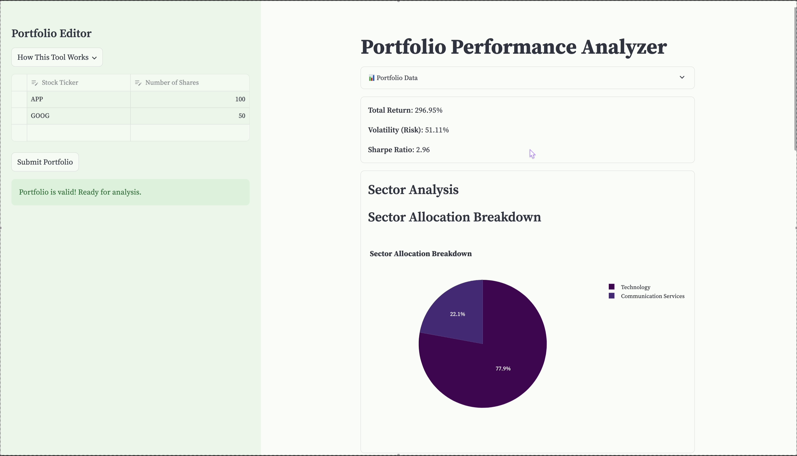

# 💼 Portfolio Performance Analyzer 💼

## Project Overview  
The Portfolio Performance Analyzer is a Streamlit-based application that allows users to analyze their stock portfolios. Users can input stock tickers and the number of shares they hold, and the tool validates the input, fetches data from Yahoo Finance, and provides insights into the portfolio's performance and composition.

[](https://youtu.be/a8Nxz7PEKwE)


## Features  
- **Dynamic Portfolio Input**: Users can add stock tickers and the number of shares interactively using a data editor in the sidebar.  
- **Validation**:  
  - Ensures stock tickers are not empty.  
  - Validates the number of shares is greater than 0.  
  - Checks if the ticker exists and fetches data from Yahoo Finance.  
- **Error Handling**:  
  - Provides detailed error messages for invalid tickers, empty input fields, and failed data fetches.  
- **Analysis**:  
  - Calculates portfolio performance metrics such as total value, individual stock contributions, and returns.  
  - Visualizes portfolio composition and performance using interactive graphs powered by Plotly.  
  - Displays **Risk vs. Return Scatter Plot** to understand portfolio risk-reward trade-offs.  
  - Performs **Sector Allocation Analysis** to display portfolio diversification by industry sectors.

## How to Use  
1. **Input Portfolio**:  
   - Use the data editor in the sidebar to add stock tickers and the corresponding number of shares.  
   - Click the Submit Portfolio button to validate and analyze the input.  
2. **Validation**:  
   - The tool validates the entered data and displays appropriate error messages if issues are found.  
   - Once the portfolio is valid, the analysis is displayed.  
3. **Analysis**:  
   - View detailed portfolio metrics and interactive visualizations to better understand your investments.  

## Installation  

### Prerequisites  
- Python 3.11  
- Pip for package management  

### Steps  
1. Clone the repository:  
   ```
   git clone https://github.com/yourusername/portfolio-performance-analyzer.git
   ```  
2. Install dependencies:  
   ```
   pip install -r requirements.txt
   ```  
3. Run the application:  
   ```
   streamlit run portfolio_analyse.py
   ```  

## Project Structure  
```
portfolio-analyzer/ 
|--.streamlit/
| |--config.toml
|-- components/
| |-- sidebar.py 
| |-- calculations.py 
| |-- graphs.py 
|-- portfolio_analyse.py 
|-- README.md 
|-- requirements.txt 
```


## Dependencies  
- **Streamlit**: Interactive web app framework.  
- **Pandas**: Data manipulation and analysis.  
- **YFinance**: Fetching stock data from Yahoo Finance.  
- **Plotly**: Interactive visualizations.  

## Example Usage  
1. Open the application.  
2. Enter stock tickers (e.g., AAPL, GOOGL) and the corresponding number of shares in the sidebar.  
3. Submit the portfolio.  
4. View validation results and detailed analysis, including risk-return scatter plot and sector allocation breakdown.  

## Future Enhancements  
- Add support for historical performance comparison.  
- Include advanced metrics like beta and portfolio diversification metrics.  
- Enable export of portfolio analysis to PDF/Excel.  
- Integrate additional data sources for broader stock market coverage.  

## Contributing  
Contributions are welcome! To contribute:  
1. Fork the repository.  
2. Create a new branch for your feature or bug fix.  
3. Submit a pull request with a detailed description of your changes.  

## License  
This project is licensed under the MIT License. See the LICENSE file for more details.
